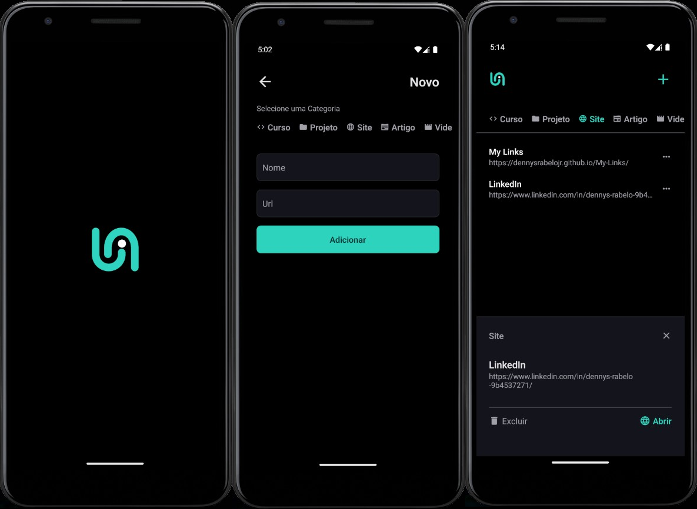

<h1 align="center"> Agregador de Links </h1>

Programa exclusivo e gratuito, promovido pela Rocketseat para ensino de tecnologias React Native.

  <a href="#-tecnologias">Tecnologias</a>&nbsp;&nbsp;&nbsp;|&nbsp;&nbsp;&nbsp;
  <a href="#-projeto">Projeto</a>&nbsp;&nbsp;&nbsp;|&nbsp;&nbsp;&nbsp;
  <a href="#memo-licença">Licença</a>&nbsp;&nbsp;&nbsp;|&nbsp;&nbsp;&nbsp;

  

 

  

## 🚀 Tecnologias

Esse projeto foi desenvolvido com as seguintes tecnologias:

- React Native
- Node.js
- Expo CLI & GO
- JavaScript
- TypeScript
- Git e Github

## 💻 Projeto

O agregador de links serve para salvar seus sites favoritos de acordo com cada categoria.

- [Acesse o projeto finalizado](https://github.com/DennysRabeloJr/Agregador-de-Links)

## :memo: Licença

Esse projeto está sob a licença MIT.

---

Verified Account©
